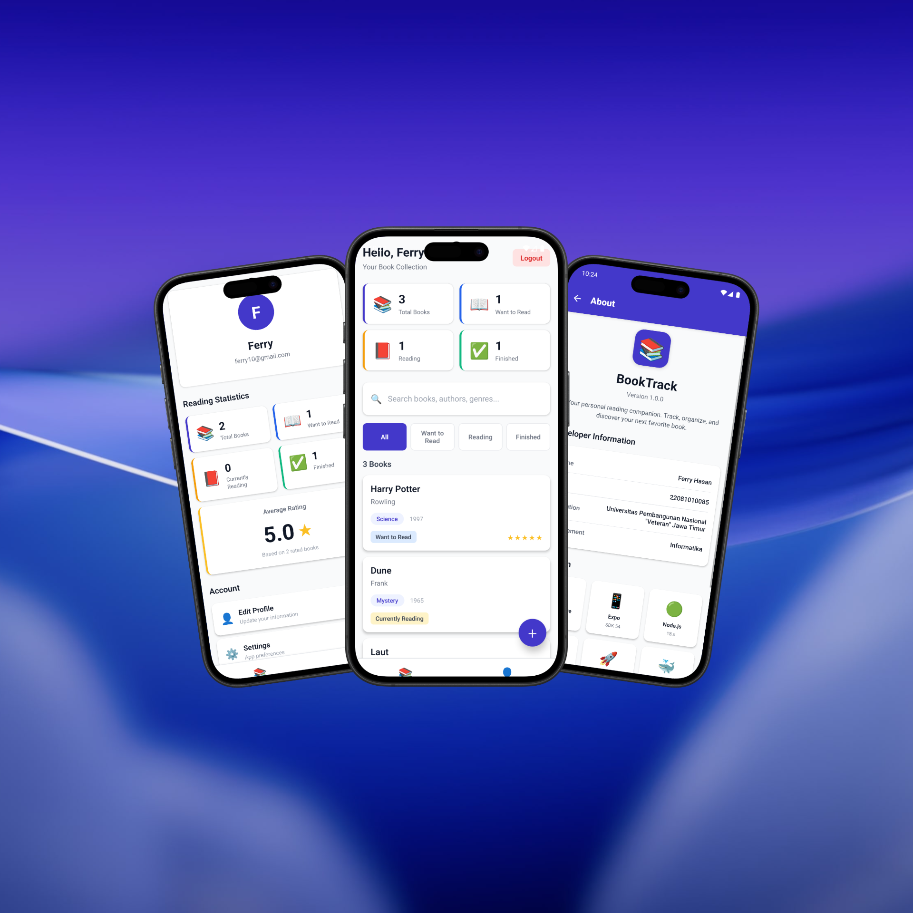

# 📚 BookTrack - Personal Book Management App

A full-stack mobile application for tracking your personal reading journey. Built with React Native (Expo) for the frontend and Node.js/PostgreSQL for the backend.



---

## 📖 Table of Contents

- [Features](#features)
- [Tech Stack](#tech-stack)
- [Prerequisites](#prerequisites)
- [Installation](#installation)
  - [Backend Setup](#backend-setup)
  - [Mobile App Setup](#mobile-app-setup)
- [Environment Variables](#environment-variables)
- [API Documentation](#api-documentation)
- [Database Schema](#database-schema)
- [Project Structure](#project-structure)
- [Testing](#testing)
- [Troubleshooting](#troubleshooting)
- [Contributing](#contributing)
- [License](#license)

---

## ✨ Features

### User Features

- 🔐 **Secure Authentication** - Register and login with email/password
- 📚 **Book Management** - Add, edit, view, and delete books
- 🔍 **Search & Filter** - Search by title/author/genre, filter by reading status
- 📊 **Reading Statistics** - Track total books, average rating, and reading progress
- 🏷️ **Reading Status** - Organize books as "Want to Read", "Currently Reading", or "Finished"
- ⭐ **Book Ratings** - Rate books from 1 to 5 stars
- 📝 **Personal Notes** - Add notes to any book (up to 2000 characters)
- 🎨 **Beautiful UI** - Modern design with smooth animations and toast notifications
- ♻️ **Pull to Refresh** - Easily refresh your book list
- 👤 **User Profile** - View your reading statistics and manage your account
- ℹ️ **About Page** - Comprehensive app and developer information

### Technical Features

- 🔒 **JWT Authentication** - Secure token-based authentication
- 🗄️ **PostgreSQL Database** - Reliable and scalable data storage
- 🐳 **Docker Support** - Easy deployment with Docker Compose
- ✅ **Input Validation** - Comprehensive validation on both frontend and backend
- 🚀 **Performance Optimized** - React.memo and useCallback for optimal performance
- 📱 **Cross-Platform** - Works on both iOS and Android (Expo)
- 🌐 **RESTful API** - Clean and well-documented API endpoints

---

## 🛠️ Tech Stack

### Frontend

- **Framework:** React Native 0.81.5
- **Platform:** Expo SDK 54.0.29
- **Navigation:** React Navigation 7.x
- **State Management:** React Context API
- **Storage:** AsyncStorage
- **HTTP Client:** Axios 1.13.2
- **UI Components:** React Native built-in components
- **Notifications:** react-native-toast-message

### Backend

- **Runtime:** Node.js 18.x
- **Framework:** Express.js 4.21.2
- **Database:** PostgreSQL 15
- **Authentication:** JSON Web Tokens (JWT)
- **Password Hashing:** bcrypt
- **Validation:** express-validator
- **CORS:** cors middleware
- **Container:** Docker & Docker Compose

---

## 📋 Prerequisites

Before you begin, ensure you have the following installed:

- **Node.js** 18.x or higher ([Download](https://nodejs.org/))
- **npm** or **yarn** package manager
- **Docker Desktop** ([Download](https://www.docker.com/products/docker-desktop))
- **Expo Go** app on your mobile device (iOS/Android)
  - [iOS App Store](https://apps.apple.com/app/expo-go/id982107779)
  - [Google Play Store](https://play.google.com/store/apps/details?id=host.exp.exponent)
- **Android Studio** (for Android Emulator) or **Xcode** (for iOS Simulator) - Optional

---

## 🚀 Installation

### Clone the Repository

```bash
git clone https://github.com/yourusername/booktrack.git
cd booktrack
```

---

### Backend Setup

#### 1. Navigate to Backend Directory

```bash
cd backend
```

#### 2. Install Dependencies

```bash
npm install
```

#### 3. Configure Environment Variables

Create a `.env` file in the `backend` directory:

```bash
# Copy the example file
cp .env.example .env
```

Edit `.env` with your configuration:

```env
PORT=3000
DATABASE_URL=postgresql://booktrack_user:securepassword123@db:5432/booktrack
JWT_SECRET=your-super-secret-jwt-key-change-this-in-production
NODE_ENV=development
```

> ⚠️ **Important:** Change `JWT_SECRET` to a strong random string in production!

#### 4. Start Backend with Docker

Make sure Docker Desktop is running, then:

```bash
# From the backend directory
docker-compose up -d
```

This will:

- Start PostgreSQL database on port 5432
- Run database initialization script
- Start Express server on port 3000

#### 5. Verify Backend is Running

```bash
# Check container status
docker-compose ps

# View logs
docker-compose logs -f backend

# Test the API
curl http://localhost:3000/api/auth/verify
```

Expected response (without token):

```json
{
  "success": false,
  "error": {
    "code": "NO_TOKEN",
    "message": "Authorization token is required"
  }
}
```

---

### Mobile App Setup

#### 1. Navigate to Mobile Directory

```bash
cd mobile
```

#### 2. Install Dependencies

```bash
npm install
```

#### 3. Configure API Base URL

The API URL is configured in [mobile/src/constants/config.js](mobile/src/constants/config.js):

- **Android Emulator:** Uses `10.0.2.2` (special IP for localhost)
- **iOS Simulator:** Uses `localhost`
- **Physical Device:** Update to your computer's local IP address

```javascript
// For physical device, find your IP:
// Windows: ipconfig (look for IPv4 Address)
// Mac/Linux: ifconfig (look for inet)
export const API_BASE_URL = __DEV__
  ? Platform.OS === "android"
    ? "http://10.0.2.2:3000/api" // Android Emulator
    : "http://192.168.1.100:3000/api" // Replace with your IP for physical device
  : "https://your-production-api.com/api";
```

#### 4. Start Expo Development Server

```bash
npx expo start
```

#### 5. Run on Device/Emulator

Choose one of the following options:

**Option A: Physical Device**

1. Open Expo Go app on your phone
2. Scan the QR code from the terminal
3. App will load on your device

**Option B: Android Emulator**

1. Start Android emulator from Android Studio
2. Press `a` in the Expo terminal
3. App will launch in emulator

**Option C: iOS Simulator (Mac only)**

1. Press `i` in the Expo terminal
2. iOS simulator will open with the app

---

## 🔐 Environment Variables

### Backend (.env)

| Variable       | Description                          | Default     | Required |
| -------------- | ------------------------------------ | ----------- | -------- |
| `PORT`         | Express server port                  | 3000        | Yes      |
| `DATABASE_URL` | PostgreSQL connection string         | -           | Yes      |
| `JWT_SECRET`   | Secret key for JWT signing           | -           | Yes      |
| `NODE_ENV`     | Environment (development/production) | development | No       |

### Frontend (config.js)

| Variable       | Description     | Required |
| -------------- | --------------- | -------- |
| `API_BASE_URL` | Backend API URL | Yes      |

---

## 📡 API Documentation

### Base URL

```
http://localhost:3000/api
```

### Authentication Endpoints

#### Register New User

```http
POST /auth/register
Content-Type: application/json

{
  "email": "user@example.com",
  "password": "SecurePass123!",
  "fullName": "John Doe"
}
```

**Response (201 Created):**

```json
{
  "success": true,
  "message": "User registered successfully",
  "data": {
    "userId": 1,
    "email": "user@example.com",
    "fullName": "John Doe",
    "token": "eyJhbGciOiJIUzI1NiIsInR5cCI6IkpXVCJ9..."
  }
}
```

#### Login

```http
POST /auth/login
Content-Type: application/json

{
  "email": "user@example.com",
  "password": "SecurePass123!"
}
```

**Response (200 OK):**

```json
{
  "success": true,
  "message": "Login successful",
  "data": {
    "userId": 1,
    "email": "user@example.com",
    "fullName": "John Doe",
    "token": "eyJhbGciOiJIUzI1NiIsInR5cCI6IkpXVCJ9..."
  }
}
```

#### Verify Token

```http
GET /auth/verify
Authorization: Bearer <token>
```

**Response (200 OK):**

```json
{
  "success": true,
  "data": {
    "userId": 1,
    "email": "user@example.com",
    "fullName": "John Doe"
  }
}
```

---

### Book Endpoints

> 🔒 All book endpoints require authentication. Include `Authorization: Bearer <token>` header.

#### Get All Books

```http
GET /books?status=finished&search=gatsby&page=1&limit=10
Authorization: Bearer <token>
```

**Query Parameters:**

- `status` (optional): Filter by reading status (want_to_read, currently_reading, finished)
- `search` (optional): Search by title, author, or genre
- `page` (optional): Page number (default: 1)
- `limit` (optional): Items per page (default: 10)
- `sortBy` (optional): Sort field (title, author, created_at, etc.)
- `sortOrder` (optional): Sort direction (asc, desc)

**Response (200 OK):**

```json
{
  "success": true,
  "data": {
    "books": [
      {
        "book_id": 1,
        "title": "The Great Gatsby",
        "author": "F. Scott Fitzgerald",
        "genre": "Classic",
        "publication_year": 1925,
        "reading_status": "finished",
        "rating": 5,
        "notes": "A masterpiece!",
        "created_at": "2024-12-18T10:00:00Z",
        "updated_at": "2024-12-18T10:00:00Z"
      }
    ],
    "pagination": {
      "currentPage": 1,
      "totalPages": 1,
      "totalBooks": 1,
      "booksPerPage": 10
    }
  }
}
```

#### Get Book Statistics

```http
GET /books/statistics
Authorization: Bearer <token>
```

**Response (200 OK):**

```json
{
  "success": true,
  "data": {
    "totalBooks": 10,
    "byStatus": {
      "wantToRead": 3,
      "currentlyReading": 2,
      "finished": 5
    },
    "byGenre": {
      "Fiction": 4,
      "Fantasy": 3,
      "Classic": 3
    },
    "averageRating": 4.2,
    "ratedBooks": 8,
    "recentlyAdded": [...]
  }
}
```

#### Get Single Book

```http
GET /books/:bookId
Authorization: Bearer <token>
```

**Response (200 OK):**

```json
{
  "success": true,
  "data": {
    "book_id": 1,
    "user_id": 1,
    "title": "The Great Gatsby",
    "author": "F. Scott Fitzgerald",
    "genre": "Classic",
    "publication_year": 1925,
    "reading_status": "finished",
    "rating": 5,
    "notes": "A masterpiece!",
    "created_at": "2024-12-18T10:00:00Z",
    "updated_at": "2024-12-18T10:00:00Z"
  }
}
```

#### Create Book

```http
POST /books
Authorization: Bearer <token>
Content-Type: application/json

{
  "title": "The Great Gatsby",
  "author": "F. Scott Fitzgerald",
  "genre": "Classic",
  "publicationYear": 1925,
  "readingStatus": "finished",
  "rating": 5,
  "notes": "A masterpiece!"
}
```

**Response (201 Created):**

```json
{
  "success": true,
  "message": "Book added successfully",
  "data": { ... }
}
```

#### Update Book

```http
PUT /books/:bookId
Authorization: Bearer <token>
Content-Type: application/json

{
  "title": "Updated Title",
  "author": "Updated Author",
  "readingStatus": "currently_reading",
  "rating": 4
}
```

**Response (200 OK):**

```json
{
  "success": true,
  "message": "Book updated successfully",
  "data": { ... }
}
```

#### Delete Book

```http
DELETE /books/:bookId
Authorization: Bearer <token>
```

**Response (200 OK):**

```json
{
  "success": true,
  "message": "Book deleted successfully"
}
```

---

## 🗄️ Database Schema

### Users Table

```sql
CREATE TABLE users (
    user_id SERIAL PRIMARY KEY,
    email VARCHAR(255) UNIQUE NOT NULL,
    password_hash VARCHAR(255) NOT NULL,
    full_name VARCHAR(100) NOT NULL,
    created_at TIMESTAMP DEFAULT CURRENT_TIMESTAMP,
    updated_at TIMESTAMP DEFAULT CURRENT_TIMESTAMP
);
```

### Books Table

```sql
CREATE TABLE books (
    book_id SERIAL PRIMARY KEY,
    user_id INTEGER NOT NULL REFERENCES users(user_id) ON DELETE CASCADE,
    title VARCHAR(255) NOT NULL,
    author VARCHAR(255) NOT NULL,
    genre VARCHAR(100),
    publication_year INTEGER,
    reading_status VARCHAR(20) NOT NULL CHECK (reading_status IN ('want_to_read', 'currently_reading', 'finished')),
    rating INTEGER CHECK (rating >= 1 AND rating <= 5),
    notes TEXT,
    created_at TIMESTAMP DEFAULT CURRENT_TIMESTAMP,
    updated_at TIMESTAMP DEFAULT CURRENT_TIMESTAMP
);

CREATE INDEX idx_books_user_id ON books(user_id);
CREATE INDEX idx_books_reading_status ON books(reading_status);
```

---

## 📁 Project Structure

```
booktrack/
├── backend/                    # Backend API (Node.js + Express)
│   ├── config/
│   │   └── db.js              # PostgreSQL connection
│   ├── controllers/
│   │   ├── auth.controller.js # Authentication logic
│   │   └── books.controller.js # Book CRUD logic
│   ├── database/
│   │   └── init.sql           # Database initialization
│   ├── middleware/
│   │   ├── auth.js            # JWT verification
│   │   └── errorHandler.js    # Global error handler
│   ├── models/
│   │   ├── user.model.js      # User database operations
│   │   └── book.model.js      # Book database operations
│   ├── routes/
│   │   ├── auth.routes.js     # Auth endpoints
│   │   └── books.routes.js    # Book endpoints
│   ├── utils/
│   │   ├── jwt.js             # JWT utilities
│   │   └── validation.js      # Validation rules
│   ├── Dockerfile             # Backend container
│   ├── docker-compose.yml     # Docker services
│   ├── server.js              # Express app entry
│   ├── package.json           # Backend dependencies
│   └── .env                   # Environment variables
│
├── mobile/                     # Mobile app (React Native + Expo)
│   ├── src/
│   │   ├── components/        # Reusable components
│   │   │   ├── BookCard.js
│   │   │   ├── Button.js
│   │   │   ├── InputField.js
│   │   │   ├── LoadingSpinner.js
│   │   │   └── StatisticsCard.js
│   │   ├── constants/         # App constants
│   │   │   ├── colors.js
│   │   │   └── config.js      # API URL configuration
│   │   ├── context/           # React Context
│   │   │   └── AuthContext.js # Auth state management
│   │   ├── navigation/        # Navigation setup
│   │   │   ├── AppNavigator.js    # Authenticated routes
│   │   │   └── AuthNavigator.js   # Authentication routes
│   │   ├── screens/           # App screens
│   │   │   ├── AboutScreen.js
│   │   │   ├── AddBookScreen.js
│   │   │   ├── BookDetailsScreen.js
│   │   │   ├── EditBookScreen.js
│   │   │   ├── HomeScreen.js
│   │   │   ├── ProfileScreen.js
│   │   │   ├── SignInScreen.js
│   │   │   ├── SignUpScreen.js
│   │   │   └── SplashScreen.js
│   │   ├── services/          # API services
│   │   │   ├── api.js         # Axios instance
│   │   │   ├── authService.js # Auth API calls
│   │   │   └── bookService.js # Book API calls
│   │   └── utils/             # Utilities
│   │       ├── storage.js     # AsyncStorage helpers
│   │       └── validation.js  # Form validation
│   ├── App.js                 # App entry point
│   ├── app.json               # Expo configuration
│   ├── package.json           # Frontend dependencies
│   └── README.md              # Mobile app docs
│
├── README.md                   # This file
└── .gitignore                 # Git ignore rules
```

---

## 🧪 Testing

### Backend Testing

Comprehensive backend tests have been performed. See [backend/PHASE8_BACKEND_TESTING_RESULTS.md](backend/PHASE8_BACKEND_TESTING_RESULTS.md) for detailed results.

**Test Summary:**

- ✅ 18/18 tests passing
- ✅ 100% success rate
- ✅ All CRUD operations verified
- ✅ Authentication & authorization working
- ✅ Input validation tested
- ✅ Error handling verified

**Run Backend Tests Manually:**

```powershell
# Test registration
$body = @{email='test@test.com'; password='Test1234!'; fullName='Test User'} | ConvertTo-Json
Invoke-RestMethod -Uri 'http://localhost:3000/api/auth/register' -Method POST -Body $body -ContentType 'application/json'

# Test login
$body = @{email='test@test.com'; password='Test1234!'} | ConvertTo-Json
$response = Invoke-RestMethod -Uri 'http://localhost:3000/api/auth/login' -Method POST -Body $body -ContentType 'application/json'
$token = $response.data.token

# Test get books
$headers = @{Authorization="Bearer $token"}
Invoke-RestMethod -Uri 'http://localhost:3000/api/books' -Method GET -Headers $headers
```

### Frontend Testing

See [mobile/PHASE5_TESTING.md](mobile/PHASE5_TESTING.md), [mobile/PHASE7_TESTING.md](mobile/PHASE7_TESTING.md), and [mobile/PHASE8_TESTING.md](mobile/PHASE8_TESTING.md) for comprehensive testing guides.

**Manual Testing Checklist:**

- [ ] User can register new account
- [ ] User can login with existing account
- [ ] Token persists across app restarts
- [ ] User can add new books
- [ ] User can edit existing books
- [ ] User can delete books
- [ ] Search and filter functionality works
- [ ] Statistics display correctly
- [ ] Toast notifications appear
- [ ] Pull-to-refresh updates data
- [ ] Logout clears session

---

## 🔧 Troubleshooting

### Backend Issues

#### Problem: Docker containers won't start

**Solution:**

```bash
# Check if ports are already in use
docker ps -a

# Stop all containers
docker-compose down

# Remove volumes and rebuild
docker-compose down -v
docker-compose up --build -d
```

#### Problem: Database connection failed

**Solution:**

1. Verify PostgreSQL container is running: `docker-compose ps`
2. Check DATABASE_URL in `.env` matches docker-compose.yml
3. View logs: `docker-compose logs db`
4. Restart containers: `docker-compose restart`

#### Problem: JWT token errors

**Solution:**

1. Ensure JWT_SECRET is set in `.env`
2. Check token format in Authorization header: `Bearer <token>`
3. Verify token hasn't expired (tokens expire after 7 days)

---

### Frontend Issues

#### Problem: Cannot connect to backend from Android Emulator

**Solution:**

- Android Emulator requires `10.0.2.2` instead of `localhost`
- Update [mobile/src/constants/config.js](mobile/src/constants/config.js):
  ```javascript
  export const API_BASE_URL = "http://10.0.2.2:3000/api";
  ```

#### Problem: Cannot connect to backend from Physical Device

**Solution:**

1. Find your computer's local IP address:
   - **Windows:** Run `ipconfig` in Command Prompt (look for IPv4 Address)
   - **Mac/Linux:** Run `ifconfig` or `ip addr` (look for inet)
2. Update config.js with your IP:
   ```javascript
   export const API_BASE_URL = "http://192.168.1.100:3000/api";
   ```
3. Ensure your phone and computer are on the same WiFi network
4. Check if firewall is blocking port 3000

#### Problem: App crashes on launch

**Solution:**

```bash
# Clear Metro bundler cache
npx expo start --clear

# Reinstall dependencies
rm -rf node_modules
npm install

# Reset Expo cache
npx expo start --reset-cache
```

#### Problem: "Network Error" when making API calls

**Solution:**

1. Verify backend is running: `curl http://localhost:3000/api/auth/verify`
2. Check API_BASE_URL in config.js matches your setup
3. Ensure no firewall blocking connections
4. Try restarting Expo dev server

---

### Common Errors

#### ValidationError: Email already exists

- **Cause:** Email is already registered
- **Solution:** Use a different email or login with existing account

#### ValidationError: Password must contain...

- **Cause:** Password doesn't meet requirements
- **Solution:** Password must have:
  - At least 8 characters
  - One uppercase letter
  - One lowercase letter
  - One number
  - One special character

#### UnauthorizedError: Invalid token

- **Cause:** Token is expired or invalid
- **Solution:** Login again to get a new token

---

## 🎯 Usage Examples

### Complete User Flow

1. **Register a new account**

   - Open app
   - Tap "Sign Up"
   - Enter email, password, and full name
   - Tap "Sign Up" button

2. **Add your first book**

   - Tap the + (FAB) button
   - Fill in book details
   - Tap "Add Book"

3. **View and manage books**

   - Browse all books on Home screen
   - Use tabs to filter by status
   - Search for specific books
   - Pull down to refresh

4. **Edit a book**

   - Tap on a book card
   - Tap "Edit Book" button
   - Update details
   - Tap "Save Changes"

5. **View statistics**

   - Navigate to Profile tab
   - See total books, average rating
   - View books by status

6. **Delete a book**
   - Open book details
   - Tap "Delete Book"
   - Confirm deletion

---

## 👨‍💻 Contributing

Contributions are welcome! Please feel free to submit a Pull Request.

1. Fork the repository
2. Create your feature branch (`git checkout -b feature/AmazingFeature`)
3. Commit your changes (`git commit -m 'Add some AmazingFeature'`)
4. Push to the branch (`git push origin feature/AmazingFeature`)
5. Open a Pull Request

---
